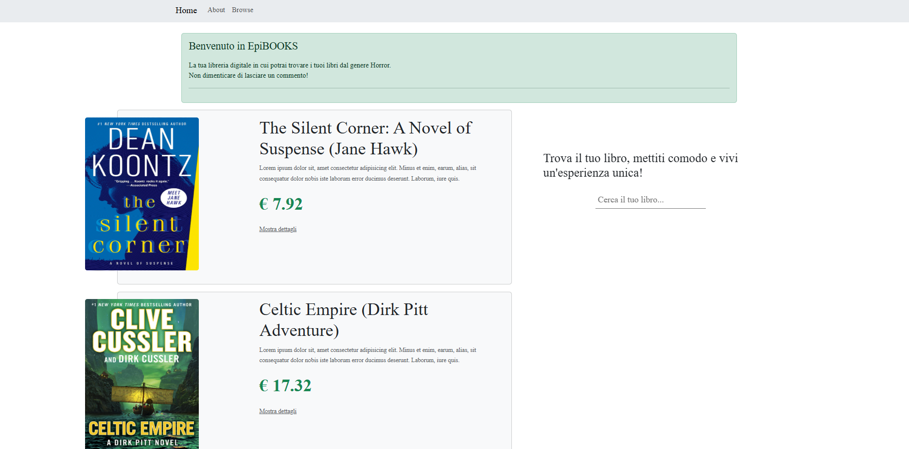
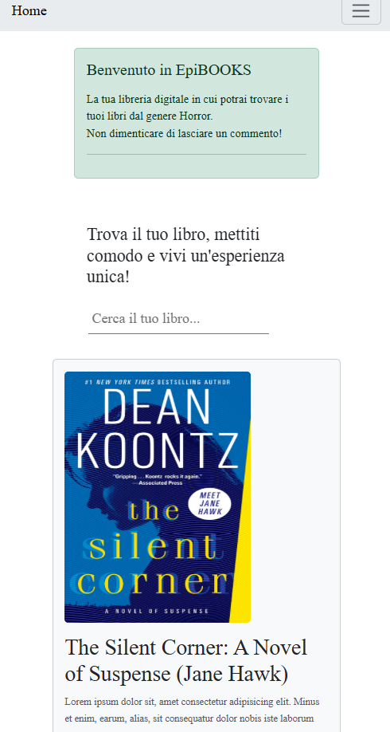

# Library - React App

Una semplice app React che mostra una lista di libri di un dato genere con card responsive usando React Bootstrap.

---

## ScreenShot




---

## Tecnologie utilizzate

- [React](https://reactjs.org/) — libreria JavaScript per la costruzione dell’interfaccia utente
- [React Bootstrap](https://react-bootstrap.github.io/) — componenti Bootstrap ottimizzati per React
- [Vite](https://vitejs.dev/) — tool di build rapido e moderno per applicazioni React
- JSON — formato usato per i dati statici dei libri
- JavaScript (ES6+) — linguaggio di programmazione usato per tutta la logica

---

## Installazione

1. Clona il repository

```bash
git clone https://github.com/patricksgro/project_25_Libray_React.git

```

2. Entra nella cartella del progetto

```bash
cd project_25_Libray_React

```

3. Installa le dipendenze

```bash
npm install

```

4. Avvia l'app in locale

```bash
npm run dev
```

## Come funziona

L'app mostra una lista di libri caricati da un file JSON locale.  
Ogni libro è rappresentato da una card con immagine, titolo, categoria e prezzo.  
Il layout è realizzato con React Bootstrap per garantire una buona esperienza su tutti i dispositivi.

---

## Contributi

Se vuoi contribuire a questo progetto, sei il benvenuto!  
Puoi aprire una issue o una pull request con le tue modifiche.

---
